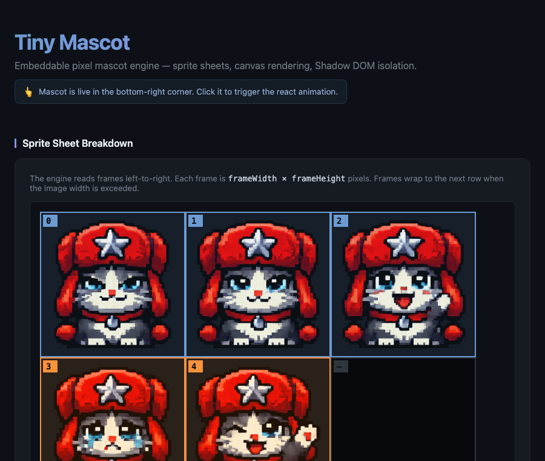
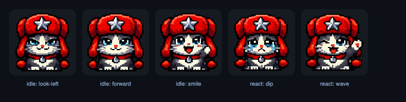
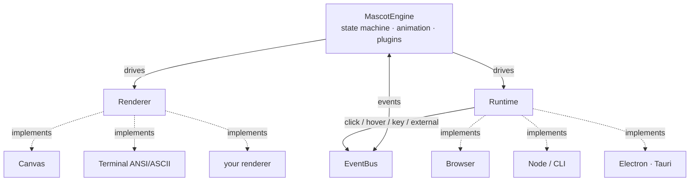

# Tiny Mascot

A tiny mascot engine that started as a website overlay and now runs across
platforms: **one engine, many renderers**. The core knows nothing about the DOM —
it drives a swappable `Renderer` + `Runtime` through an `EventBus`.



### Sprite frames

Drop a mascot into any page from a single sprite sheet. The demo cat below is
sliced from a uniform grid; `idle` cycles the calm frames and `react` plays the
wave on click.



## Architecture



The engine is platform-agnostic. A **Renderer** decides *how* a frame is drawn
(canvas pixels, terminal characters, …); a **Runtime** decides *where* it lives
and supplies the loop, viewport, and input (browser, Node, Electron, Tauri).
Everything talks over a typed **EventBus**.

## Features

- Platform-agnostic core: `Renderer` + `Runtime` + `EventBus` abstractions
- Browser canvas renderer with Shadow DOM isolation + pixel-perfect drawing
- Terminal renderer (ANSI/ASCII) + Node runtime for CLI mascots
- Desktop runtimes (Electron, Tauri) with always-on-top overlay config + IPC triggers
- Framework adapters: React, Vue, Svelte, Solid, Preact, and a Web Component
- Event-driven state machine: `idle` / `react` / `hover` / `sleep` / `busy` / custom
- Plugin system + built-in behavior plugins (idle-sleep, hover-react, key-trigger)
- Streaming integration: WebSocket/OBS trigger bridge
- Universal asset pipeline: spritesheet + ASCII packs, runtime animation registry
- Position presets (`top-left`, `top-right`, `bottom-left`, `bottom-right`, `center`) with inward + relative offsets

## Package map

| Import | What |
|---|---|
| `mascot-plugin` | Core engine, `createBrowserMascot`, `Renderer`/`Runtime`/`EventBus` |
| `mascot-plugin/react` | React `<Mascot/>` |
| `mascot-plugin/vue` | Vue `Mascot` component |
| `mascot-plugin/svelte` | Svelte `use:mascot` action |
| `mascot-plugin/solid` | Solid `Mascot` component |
| `mascot-plugin/preact` | Preact `<Mascot/>` |
| `mascot-plugin/web-component` | `<tiny-mascot>` custom element |
| `mascot-plugin/auto-init` | auto-defines `<tiny-mascot>` + `TinyMascot` global (zero-config) |
| `mascot-plugin/terminal` | `TerminalRenderer` / `AnsiRenderer` |
| `mascot-plugin/node` | `NodeRuntime`, `loadAsciiAsset` |
| `mascot-plugin/cli` | `createCliMascot` + terminal/node re-exports |
| `mascot-plugin/electron` | `ElectronRuntime` + overlay window config |
| `mascot-plugin/tauri` | `TauriRuntime` + overlay config |
| `mascot-plugin/plugins` | `idleSleep`, `hoverReact`, `keyTrigger` |
| `mascot-plugin/obs` | `websocketTriggers` streaming bridge |
| `mascot-plugin/asset-pipeline` | `AssetLoader`, `AnimationRegistry`, `PackManager` |
| `mascot-plugin/packer` | `packFrames`, Aseprite/GIF/PNG importers, `mascot-pack` CLI |

Framework/desktop deps (`react`, `vue`, `solid-js`, `preact`, `svelte`, `electron`,
`@tauri-apps/api`) are **optional peers** — install only what you use.

## Installation

```sh
npm install mascot-plugin
```

## Zero-config (no assets, no JS)

The web component ships with a built-in default mascot, so you can drop one
into any page with a single script tag and no spritesheet of your own:

```html
<script type="module" src="https://esm.sh/mascot-plugin/auto-init"></script>
<tiny-mascot position="bottom-right" size="64"></tiny-mascot>
```

`mascot-plugin/auto-init` defines the `<tiny-mascot>` custom element and exposes
a `TinyMascot` global. Any `<tiny-mascot>` already in the DOM is auto-upgraded.
Omit `spritesheet`/`metadata` to use the bundled default character.

## React usage

```tsx
import { Mascot } from 'mascot-plugin/react';

<Mascot
  spritesheet="/mascot.png"
  metadata="/metadata.json"
  size={32}
  fps={12}
  position="bottom-right"
  offsetX={20}
  offsetY={20}
/>
```

## Web Component usage

```html
<script type="module">
  import 'mascot-plugin/web-component';
</script>

<tiny-mascot
  spritesheet="/mascot.png"
  metadata="/metadata.json"
  size="32"
  fps="12"
  position="bottom-right"
  offset-x="20"
  offset-y="20">
</tiny-mascot>
```

## Vanilla JS usage

```js
import { MascotEngine } from 'mascot-plugin';

const engine = new MascotEngine({
  spritesheet: '/mascot.png',
  metadata: '/metadata.json',
  size: 32,
  fps: 12,
  position: 'bottom-right',
  offsetX: 20,
  offsetY: 20,
});

await engine.start();

// later:
engine.stop();
```

## Sprite metadata format

Place a `metadata.json` alongside your spritesheet:

```json
{
  "frameWidth": 32,
  "frameHeight": 32,
  "animations": {
    "idle": {
      "frames": [0, 1, 2, 3],
      "loop": true
    },
    "react": {
      "frames": [4, 5, 6],
      "loop": false
    }
  }
}
```

Frames are zero-indexed left-to-right across the spritesheet rows. `react` plays once on click then returns to `idle`.

## Building a spritesheet with `mascot-pack`

Don't hand-author sheets — pack frames from sources you already have. The
`mascot-pack` CLI (from `mascot-plugin/packer`) reads frame PNGs, an Aseprite
spritesheet export, or a GIF and emits a uniform-grid PNG + `metadata.json`.

```sh
# from a folder of frame PNGs (sorted by filename)
mascot-pack --dir ./frames --out mascot.png --metadata metadata.json \
  --idle 0-3 --react 4-5

# from individual files
mascot-pack ./frames/idle0.png ./frames/idle1.png --out mascot.png --metadata metadata.json

# from an Aseprite spritesheet export (sheet.png + sheet.json)
mascot-pack --aseprite sheet.json --sheet sheet.png --out mascot.png --metadata metadata.json

# from a GIF (each frame becomes a sheet cell)
mascot-pack --gif cat.gif --out mascot.png --metadata metadata.json
```

`--idle`/`--react` take ranges (`0-3`, `4,5`) over the zero-indexed input order.
Without ranges, all frames become a looping `idle` animation. Uses the optional
`pngjs` / `omggif` deps (pure JS, installed automatically).

Programmatic API: `import { packFrames, decodeGif, parseAsepriteFrameRects } from 'mascot-plugin/packer'`.

## Position presets

| Value | Anchor | `offsetX` direction | `offsetY` direction |
|---|---|---|---|
| `top-left` | top-left corner | right | down |
| `top-right` | top-right corner | left (inward) | down |
| `bottom-left` | bottom-left corner | right | up (inward) |
| `bottom-right` | bottom-right corner | left (inward) | up (inward) |
| `center` | viewport center | right | down |

Positive offset values always move the mascot toward the interior of the viewport.

## Other framework adapters

```ts
// Vue
import { Mascot } from 'mascot-plugin/vue';

// Solid
import { Mascot } from 'mascot-plugin/solid';

// Preact
import { Mascot } from 'mascot-plugin/preact';

// Svelte — action directive
import { mascot } from 'mascot-plugin/svelte';
// <div use:mascot={{ spritesheet, metadata, position: 'bottom-right' }} />
```

All adapters take the same `MascotConfig` props as React and manage the engine
lifecycle (create on mount, stop on unmount, recreate when inputs change).

## CLI / terminal usage

```ts
import { createCliMascot } from 'mascot-plugin/cli';

// ascii pack: { metadata, frames: string[] }
const mascot = await createCliMascot('./mascot.ascii.json', {
  fps: 6,
  position: 'bottom-right',
});
await mascot.start();
```

`NodeRuntime` drives the loop and forwards key presses; `TerminalRenderer`
positions ASCII frames with ANSI cursor codes. See `packages/cli/src/demo.ts`.

The bundled `cutie.json` pack animates in the terminal corner (idle loop, reacts on keypress):

```
┌──────────────────────────────┐
│ (^_^)   idle frame 0          │
│ (-_-)   idle frame 1 (blink)  │
│ (^o^)   react frame (keypress)│
└──────────────────────────────┘
```

## Plugins

```ts
import { createBrowserMascot } from 'mascot-plugin';
import { idleSleep, hoverReact, keyTrigger } from 'mascot-plugin/plugins';

const mascot = await createBrowserMascot(config);
mascot
  .use(idleSleep({ delayMs: 15000 }))           // → 'sleep' after inactivity
  .use(hoverReact())                            // hover → 'hover' state
  .use(keyTrigger({ bindings: { ' ': 'react' } }));
await mascot.start();
```

Write your own by implementing `MascotPlugin` (`name` / `initialize(ctx)` /
`destroy()`); `ctx` exposes the `EventBus` and `setState`.

## Streaming / OBS triggers

```ts
import { websocketTriggers } from 'mascot-plugin/obs';

// backend sends JSON {"name":"wave"} → mascot plays its 'wave' animation
mascot.use(websocketTriggers({ url: 'ws://localhost:4455' }));
```

Or fire triggers manually from anywhere: `mascot.emit('wave')`.

## Custom platforms

The engine is platform-agnostic — provide your own `Renderer` + `Runtime`:

```ts
import { MascotEngine, EventBus } from 'mascot-plugin';

const engine = new MascotEngine({
  renderer: myRenderer,   // implements Renderer (init/draw/clear/destroy)
  runtime: myRuntime,     // implements Runtime (mount/getViewport/onTick/onResize/destroy)
  events: new EventBus(),
  asset,                  // a LoadedAsset
  size: 32,
  fps: 12,
});
await engine.start();
```

## Running the example

`example/index.html` is a self-contained visual demo (live mascot + sprite-sheet
breakdown). It loads the engine as a classic-script global bundle
(`example/tiny-mascot.global.js`), so it works **two ways**:

- **Double-click** `example/index.html` (opens as `file://`) — works directly.
- **Or serve it**: `python3 -m http.server 8077` then open
  `http://localhost:8077/example/index.html`.

The live mascot animates via `requestAnimationFrame`; it renders in any real
browser. (Headless screenshot tools that fast-forward virtual time only fire
rAF once, so they will not capture the animation — open it in a real browser.)

Rebuild the example bundle after changing the core engine:

```sh
npm run example
```

## Scripts

- `npm run build` — build all package entries (ESM + CJS + d.ts)
- `npm test` — run the vitest suite
- `npm run lint` — eslint
- `npm run example` — rebuild the standalone example bundle
